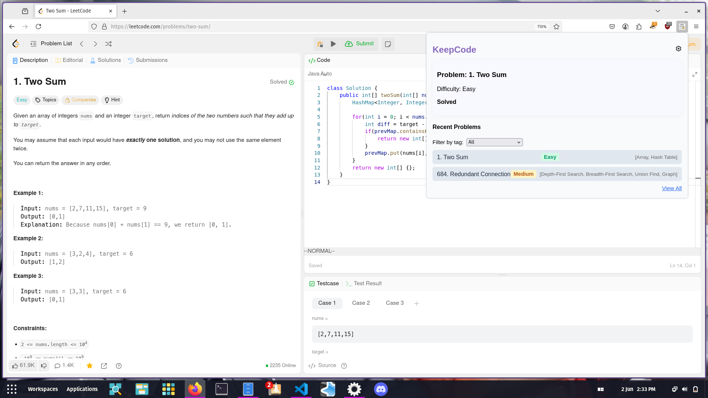
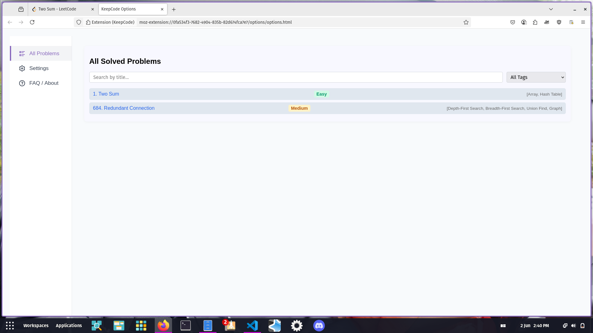

# KeepCode

A browser extension to help you track your LeetCode progress, manage problems, and stay motivated while preparing for interviews, OAs, or if you just love DSA.

## Table of Contents

- [KeepCode](#keepcode)
  - [Table of Contents](#table-of-contents)
  - [Features](#features)
  - [Screenshots](#screenshots)
  - [Installation](#installation)
  - [Usage](#usage)
  - [Options](#options)
  - [Contributing](#contributing)
  - [Roadmap](#roadmap)
  - [License](#license)
  - [Acknowledgements](#acknowledgements)
  - [Contact](#contact)

## Features

- Automatically track solved LeetCode problems
- Organizes solved problems by tag/topic
- Displays recently solved problems
- Privacy safe (no personal data is stored or sent anywhere)

## Screenshots

## Installation

1. Download the latest release from [Releases](https://github.com/kiing-dom/leetcode-tracker/releases).
2. Unzip the package.
3. Go to your browser’s extensions page.
4. Enable "Developer mode" and load the unpacked extension from the extracted folder.

## Usage

- Click the extension icon to open the popup.
- Use the options page to customize your experience.
- Progress is automatically tracked as you solve problems on LeetCode.

## Options

- [Describe available options and settings here]

## Contributing

Contributions are welcome! Please see [CONTRIBUTING.md](CONTRIBUTING.md) for guidelines.

1. Fork the repository
2. Create your feature branch (`git checkout -b feature/cool-new-feature`)
3. Commit your changes (`git commit -m 'Add cool new feature'`)
4. Push to the branch (`git push origin feature/cool-new-feature`)
5. Open a pull request

## Roadmap
- [ ] [Need a way to sync progress across devices]
- [ ] [and more]

## License

Distributed under the MIT License. See [LICENSE](LICENSE) for more information.

## Acknowledgements

- [LeetCode](https://leetcode.com/)
- all the users <3

## Contact

my twitter: [@_dngi](https://twitter.com/_dngi)
